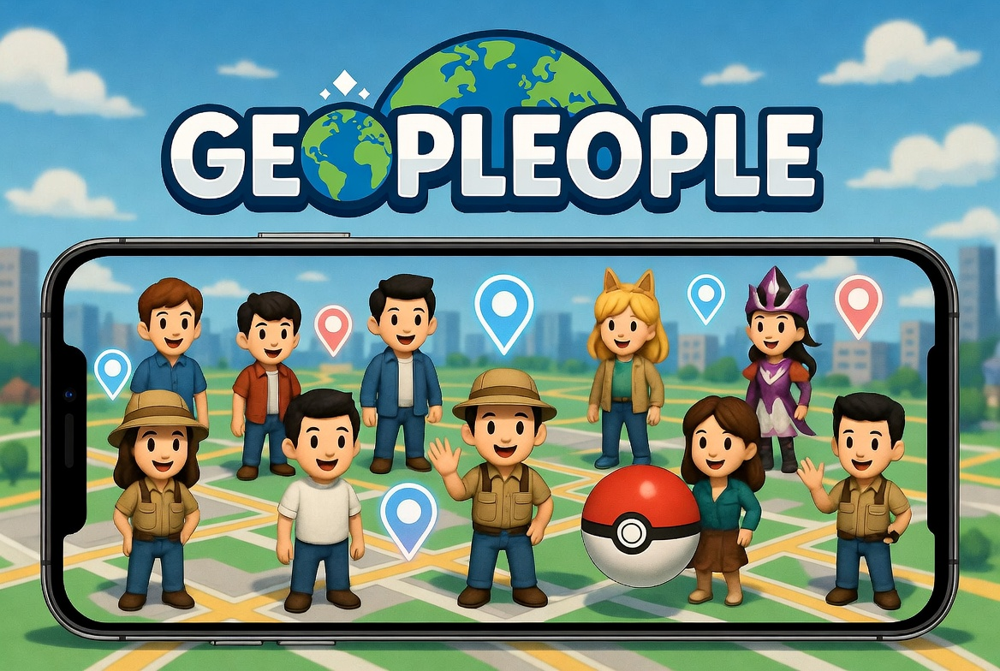
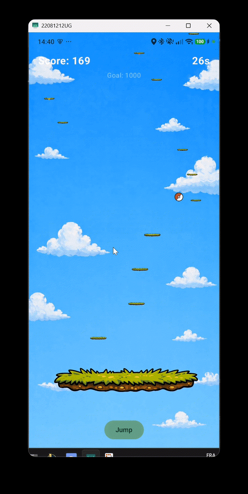

# GeoPeople

<p align="center">
  
</p>

<p align="center">
  A location-based Android game where players explore the map, discover people nearby, win mini-games, and build the highest-scoring collection.
</p>

<p align="center">
  
</p>


## Overview

GeoPeople is a mobile game built with Kotlin and Jetpack Compose on Android, backed by a TypeScript and Express API.

The game loop is simple:

- move in the real world
- discover cards generated around your location
- launch a mini-game to capture a character
- grow your inventory and improve your score
- climb the leaderboard

## Main Features

- Real-time player tracking with GPS permissions and location updates
- OpenStreetMap-based map exploration with nearby cards
- Character capture flow tied to mini-game success
- Inventory with collectible cards and detail screens
- Leaderboard synced with the backend
- Profile and persistent player session
- Collection-based scoring system with score multipliers

## Tech Stack

### Frontend

- Kotlin
- Jetpack Compose
- Android SDK 34
- OpenStreetMap via osmdroid
- OkHttp for API requests

### Backend

- Node.js
- TypeScript
- Express
- CORS and dotenv

## Project Structure

```text
GeoPeople/
├── frontend/   # Android application
├── backend/    # Express API and scoring logic
└── readmeAssets/
```

## Gameplay Flow

1. The player launches the app and grants location permission.
2. The app creates or restores a player profile.
3. Nearby cards are loaded around the current position.
4. The player reaches a card area and completes a mini-game.
5. The backend validates the capture and updates the score.
6. The inventory and leaderboard refresh in the app.

## Running The Project

### 1. Start the backend

```bash
cd backend
npm install
npm run dev
```

The API starts on `http://localhost:3000` and exposes a health check at `GET /api/health`.

### 2. Configure the Android app

The Android client currently calls the backend from:

```kotlin
private const val BASE_URL = "http://127.0.0.1:3000/api"
```

This value is defined in `frontend/app/src/main/java/com/example/geopeople/data/ApiService.kt`.

- On an Android emulator, use `http://10.0.2.2:3000/api`
- On a physical device, use your machine's local network IP

### 3. Run the frontend

Open the `frontend/` project in Android Studio, then run the `app` configuration on an emulator or Android device.

You can also build from the command line:

```bash
cd frontend
./gradlew assembleDebug
```

## Testing

### Backend

```bash
cd backend
npm test
```

The backend test suite currently covers the scoring service.

## Notable Game Systems

- Card discovery around the player location
- Capture validation through the backend
- Inventory persistence through player restoration
- Score calculation with collection bonuses based on initials, place, relation, and first-letter groups
- Leaderboard ranking based on total score

## Current Repository Layout

- `frontend/` contains the Android app, UI, location logic, API access, and embedded mini-games
- `backend/` contains the REST API, models, routes, services, and scoring logic
- `readmeAssets/` contains media used in this README

## Screens And Media

- Start screen artwork: `readmeAssets/backgroundStartimage.jpg`
- Gameplay preview: `readmeAssets/play.gif`

## Notes

- The app requires location permission to unlock the main gameplay loop.
- The backend must be running for player registration, captures, inventory restore, and leaderboard updates.
- If cards returned by the backend are not playable nearby, the app falls back to locally loaded data from the Android side.

## License

This project is distributed under the MIT License. See [LICENSE](LICENSE) for details.